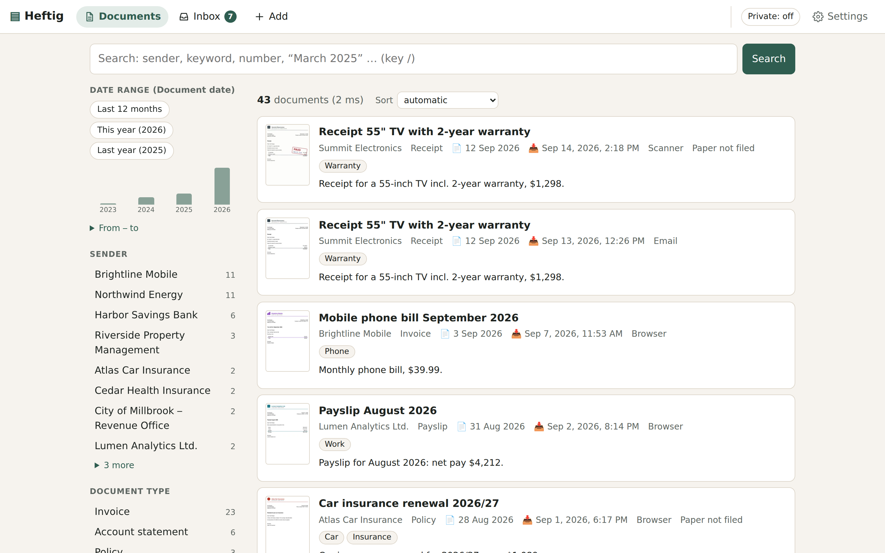
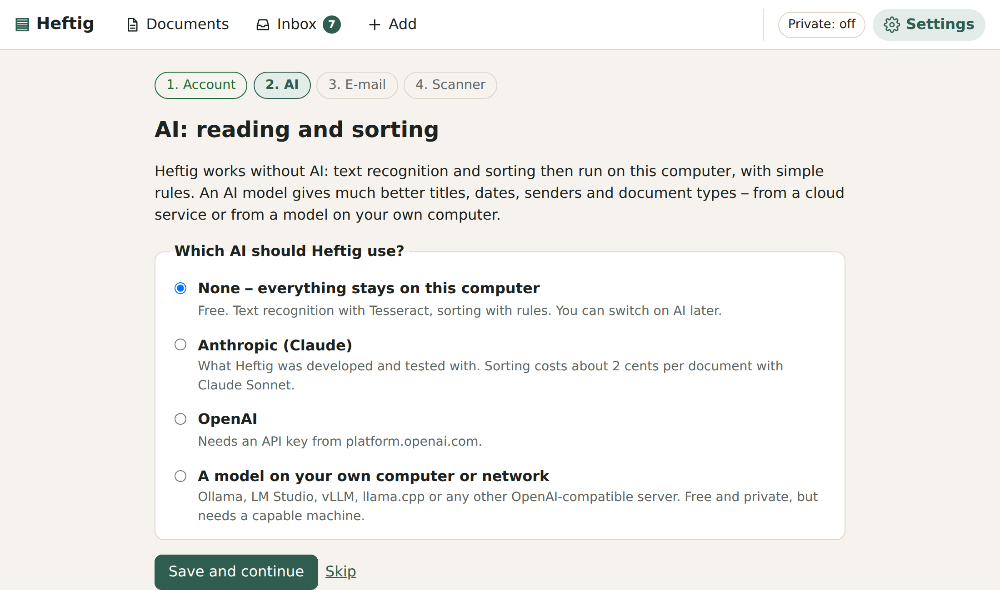
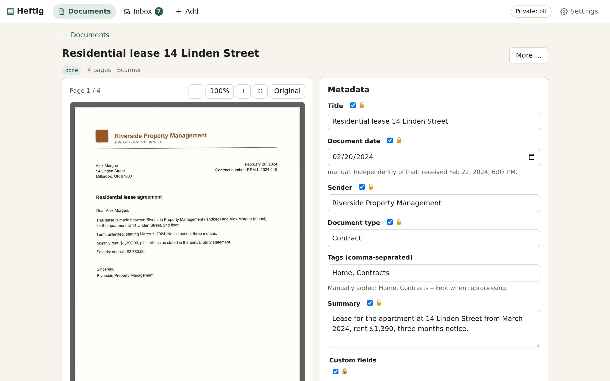
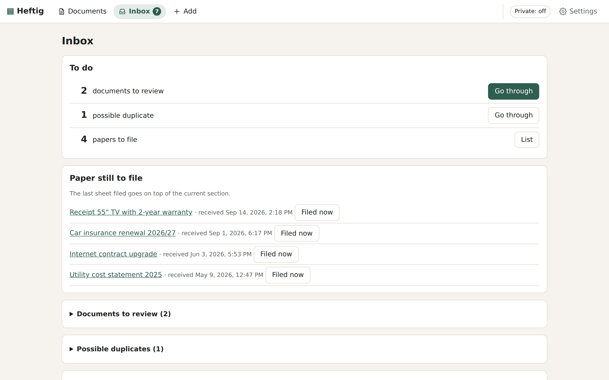
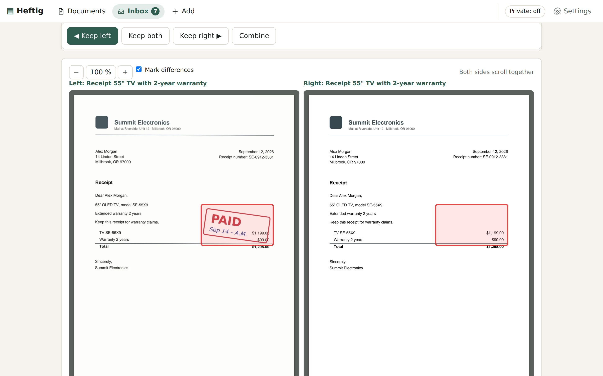
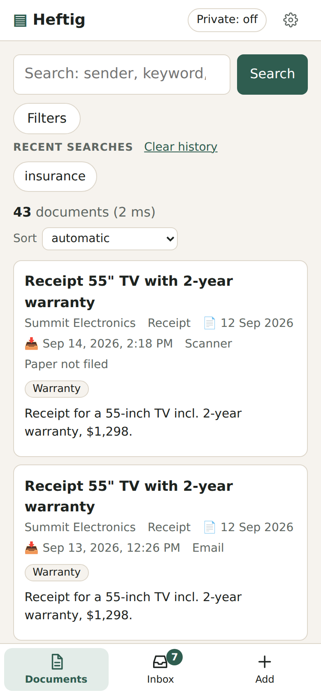
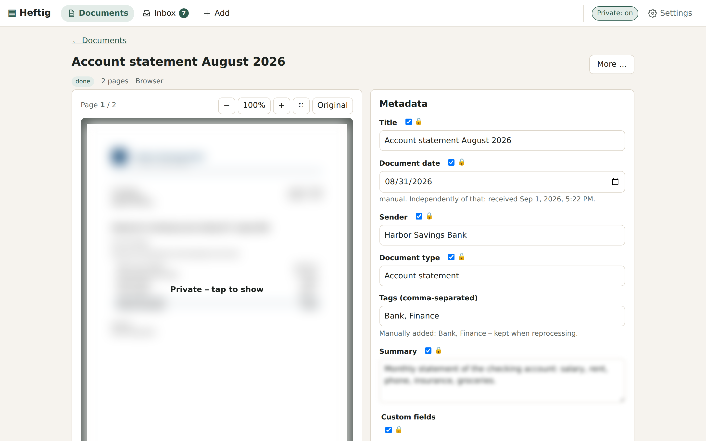

# Heftig

A self-hosted archive for the paper and PDFs of a household: letters, invoices, contracts,
statements. Scan them, forward them or drop them in a folder; Heftig keeps the original, reads the
text, sorts it, and finds it again in milliseconds. It also remembers where the paper is.



## Why Heftig

**Portable.** The archive is a folder of ordinary files: every original byte for byte, next to it a
JSON file with everything Heftig knows about it and the recognised text as Markdown. The SQLite
database is only an index – delete it and Heftig rebuilds it from the files. Copy the folder to
another machine and you have moved your archive; any backup tool can back it up; you can read it
without Heftig.

**Small on purpose.** One person's archive, one inbox, one way to file paper. Heftig collects,
reads, sorts, finds and remembers where the paper is – and leaves out what a household doesn't
need: roles, workflows, sharing, plugins. Where a decision was possible, it was made, so there is
little to configure.

**Easy to change.** About 17,000 lines of plain Python, server-rendered HTML and a little
JavaScript, no build step, no front-end framework, and about 350 tests that run in a minute and
a half without network access. That makes it a good fit for coding agents such as Claude Code or
Codex: describe what you want different, let the agent change it and run the tests.
[AGENTS.md](AGENTS.md) gives it the map and the rules that are easy to break. Heftig itself was
built this way.

## Try it

On Linux, with Podman or Docker (the installer offers to install Podman if neither is there):

```sh
curl -fsSL https://raw.githubusercontent.com/jo-tud/heftig/main/install.sh | sh
```

It downloads the container image, creates `~/heftig`, starts Heftig (also after a reboot) and
prints the address of the setup page. There you create your (local) account and, if you like, connect an
AI, a mailbox and your scanner – no configuration files. Running the installer again updates
Heftig. To remove it: `podman rm -f heftig` (or `docker rm -f heftig`) and delete `~/heftig`.



Just looking? Build a demo archive with fictional documents:
`uv run python scripts/demo_archive.py /tmp/heftig-demo`, then
`HEFTIG_ARCHIVE_DIR=/tmp/heftig-demo uv run heftig run` and sign in as `demo` /
`demo-password-1234`.

Other ways to run it (Docker Compose, without containers, behind a reverse proxy):
[docs/operations.md](docs/operations.md).

## What it does

<table>
<tr>
<td width="50%"></td>
<td width="50%"></td>
</tr>
<tr>
<td>Every document: pages, text, what was recognised, your notes – and where the paper lies.</td>
<td>The inbox lists what needs you: suggestions to check, possible duplicates, paper to file.</td>
</tr>
<tr>
<td></td>
<td> </td>
</tr>
<tr>
<td>The same invoice as e-mail and as scan? Heftig compares both page by page and marks what differs – a signature, a stamp, a note.</td>
<td>Works on the phone (with a document camera), and a privacy mode blurs amounts, IBANs and other numbers until you tap them.</td>
</tr>
</table>

- **Getting documents in:** upload in the browser, the phone's document camera, a scanner folder
  (network share), a mailbox for forwarded mail and scan-to-email, a REST API. Everything lands in
  one inbox. Pages scanned separately can be combined into one document.
- **Reading and sorting:** embedded PDF text first, OCR for scans (Tesseract on your computer, or
  an AI model). Title, date, sender, document type, tags, amounts and contract numbers are
  suggested; dates and numbers are only accepted if they really appear in the text. Anything you
  correct is locked and never overwritten.
- **Finding:** full-text search that tolerates typos, umlauts and spacing in numbers, understands
  phrases like “March 2025” or “last year”, shows filters with counts and a timeline, suggests
  while you type, and marks the hits on the page. Optionally, an AI turns a question like
  “phone bills over $50 last year” into filters. The search itself never leaves your computer.
- **Paper without archive numbers:** file letters in a binder with a section per month, newest
  on top. Heftig records the position when you mark a letter as filed and later shows exactly
  where it is, and which letters lie above and below it.
- **Keeping it clean:** duplicates are recognised (the identical file, and the same letter as
  scan and PDF); deleted documents stay in the trash for 30 days; combining and bulk deletion
  can be undone.
- **Asking questions:** connect Claude via MCP and ask “how much did I pay for electricity in
  2025?” – with links to the pages the answer comes from ([docs/mcp.md](docs/mcp.md)).

The interface is in English and German.

## AI is optional

Heftig works completely offline: Tesseract reads scans, simple rules sort documents. An AI model
makes titles, dates, senders and types much better. You choose it on the setup page:

| | What it costs | What leaves your computer |
|---|---|---|
| **None** | nothing | nothing |
| **Anthropic (Claude)** – what Heftig was developed with | sorting about 2 cents per document (Claude Sonnet), reading scans with AI about 2 cents per page | the document text; page images only if AI reading is switched on |
| **OpenAI** | depends on the model | the same |
| **Your own model** (Ollama, LM Studio, vLLM, llama.cpp …) | your electricity | nothing |

Cloud use is off until you switch it on and confirm what is sent, and the inbox shows what the
AI has cost so far. Details, and what is sent exactly: [docs/providers.md](docs/providers.md).

## Status

Heftig is young (version 0.x) but in daily use, with about 1,700 documents so far. Things to
know:

- It is **not** a legally certified archive (no WORM storage, no signatures). Keep originals
  where the law asks for them.
- One user per archive.
- Tesseract is clearly weaker than AI models on handwriting and poor scans.
- The rule-based sorting without AI knows German and English letters best.

## Documentation

| | |
|---|---|
| [docs/guide.md](docs/guide.md) | Using Heftig: inbox, filing paper, scan sessions, duplicates, search tips |
| [docs/operations.md](docs/operations.md) | Installation variants, HTTPS and phones, backup and restore, updates, logs |
| [docs/scanner-imap.md](docs/scanner-imap.md) | Scanners (network folder, scan-to-email), SMB shares, mail import |
| [docs/providers.md](docs/providers.md) | AI and OCR providers, local models, privacy |
| [docs/search.md](docs/search.md) | How search works: ranking, typos, syntax, date phrases |
| [docs/mcp.md](docs/mcp.md) | Ask Claude about your archive (read-only) |
| [docs/data-format.md](docs/data-format.md) | The archive on disk, export and import |
| [docs/architecture.md](docs/architecture.md) | Components, pipeline, security model – the place to start before changing things |
| [docs/paperless.md](docs/paperless.md) | Moving from Paperless-ngx |

## Changing Heftig

```sh
git clone https://github.com/jo-tud/heftig.git && cd heftig
uv sync                 # Python 3.11+, dependencies incl. dev tools
make test               # the test suite, offline
uv run python scripts/demo_archive.py /tmp/demo && HEFTIG_ARCHIVE_DIR=/tmp/demo uv run heftig run
```

Start with [docs/architecture.md](docs/architecture.md). Interface texts are English in the code
and translated in `src/heftig/locale/`; `uv run python scripts/i18n.py check de` shows what is
missing. Contributions are welcome – see [CONTRIBUTING.md](CONTRIBUTING.md).

## License

MIT, see [LICENSE](LICENSE).
