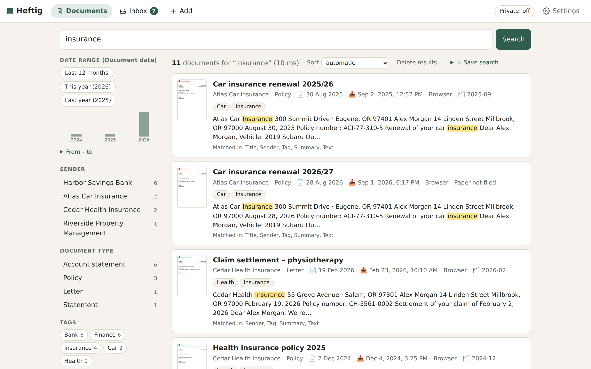

# Using Heftig

How the parts fit together in daily use. Setup and operation: [operations.md](operations.md).

## The daily routine

1. **Documents come in** – from the scanner folder, the mailbox, the phone camera (*Add → Scan*)
   or an upload (*Add*). When uploading, choose *digital document* for born-digital files or
   *paper* for a scan or photo of paper you still have to file.
2. **Heftig reads and sorts them** in the background: text from the PDF or by OCR, then title,
   date, sender, type, tags, amounts. The badge on *Inbox* counts what needs you.
3. **The inbox** lists the tasks: documents to review (an uncertain date, AI suggestions, a
   failed text recognition), possible duplicates, and paper still to file. *Reviewed → next*
   walks through them one by one; *Skip* leaves a document for later, *Trash → next* deletes it
   and goes on (with *Undo* on the next document).
4. **Correct what's wrong** on the document page. A field is saved as soon as you leave it (or
   pick a value); *Saved · Undo* appears next to it, and *Undo* restores the previous value,
   its lock and the AI's suggestions. Nothing is saved while you type, and links and buttons
   on the page wait for a save still running; leaving the page otherwise (back button, closing
   the tab, reloading) still saves the field you were in – a reload that is quicker than the save
   waits for it. Notes are saved the same way, and after a pause in typing; a new note moves into
   the list as soon as you leave its field (Ctrl+Enter also finishes it). Tags are shown as small chips: type a tag and press Enter or a comma
   to add it, × removes one. Every field you edit is locked – reprocessing
   never overwrites it. Suggestions of the AI are accepted or dismissed there (*Dismiss* only
   removes the suggestion; the field keeps its value), or on *Suggestions in bulk* (linked
   from the inbox) for many documents at once.
5. **File the paper** and click *Filed just now* on its page (or *Filed now* in the inbox list) –
   or let Heftig do it for every scan (*Settings → Scanner and phone → I file every scanned letter
   right away*).

Nothing is ever lost by a click: deleted documents go to the trash for 30 days, combining and
bulk deletion can be undone.

## Paper without archive numbers

Paper goes into binders, one section per month, newest letter always **on top** of the current
month's section. Heftig knows the **current binder** (*Settings → Binders*, first called
"Binder 1"; rename it to what you write on its spine). When you mark a letter as filed, Heftig
records the binder, the section and the order; the document page then shows "binder Heftig 1,
section 2026-09, position 3 from the top" and the letters directly above and below it. The
section is the month you *filed* the letter, not its date.

The everyday cases:

- **One letter:** put it on top of the current binder and click *Filed just now* on its page
  (or *Filed now* in the inbox list).
- **A scanned stack** (several letters at once): see
  [Filing a scanned stack](#filing-a-scanned-stack) below – the whole stack goes on top, in the
  order it comes out of the scanner.
- **Binder full:** *Settings → Binders → This binder is full – start the next one* (the name
  is suggested: "Heftig 1" → "Heftig 2"). From then on everything goes into the new binder;
  positions in the full one stay as they are.
- **Taking a letter out** (lending it, handing it to the tax adviser): *Taken out …* on its
  page, optionally with where it is. It keeps its place; *Put back in its place* returns it.
- **Moving a letter to another binder:** *Into another binder …* – it goes on top of that
  binder's current section.
- **Deleting a filed document:** the undo bar says where its paper lies ("take the paper out of
  binder Heftig 1: section 2026-09, position 3 from the top"). *Leave it in the binder* keeps
  the sheet's place counting instead, so the positions of the other letters stay right – also
  after the trash is emptied; such sheets are listed under *Settings → Binders*. When you keep
  one of two duplicates and the deleted one was filed, the kept copy takes over its place.
- **Paper that is never filed** (a referral left at the doctor's): *Not kept*, in the inbox
  list or on the document page.
- **Paper somewhere else entirely** (an old binder you don't file into): *Somewhere else …*
  with a note.

Three dates are kept apart:

| Field | Meaning | Set by |
|---|---|---|
| Document date | The date printed on the letter; without one, the date the document is made up to (a statement "per 30.09.2021", terms "Stand: 01.10.2023" – shown as *as-of date*). May be empty, with a reason ("not found", "uncertain"). | The classifier or a local rule (only if it appears in the text) or you |
| Received | When it first arrived in Heftig. Never changes. | Heftig |
| Filed | When the paper went into the binder. Empty until you confirm it. | You, or automatically for scans |

## Digitising existing binders (batches)

Before scanning a stack from an old binder, start a **batch** in the inbox: name the binder
("Insurance") and choose once what happens with the paper afterwards:

- **back into the binder** – every scan remembers "binder Insurance" as the paper's place;
- **into the Heftig filing** – at the end one click files all of them into the current binder,
  the stack as it comes out of the scanner (a document feeder keeps the order: the first
  scanned sheet on top);
- **away, except what matters** – the AI suggests per document whether to keep the original
  (contracts, certificates, assessments, policies …); the inbox lists the few to keep with their
  position in the stack, and one click files those and marks the rest as discarded.

### Filing a scanned stack

A document feeder keeps the order of the stack: what comes out is in the order you put in, the
first scanned sheet on top once the stack lies face up (with an output tray that stacks face
down, turn the stack over as a whole). Heftig counts on exactly that:

1. Start a batch *into the Heftig filing* in the inbox.
2. Scan the stack (duplex is fine, see [Blank pages](#blank-pages)).
3. Take the stack out of the scanner as it is – don't reorder it – and put it **as a whole on
   top** of the current binder.
4. Sheets you throw away instead: *Not kept* on their page (or in the inbox) before the next step.
5. Click *All N filed as they came out of the scanner*.

Heftig then records the new sheets above everything already in the binder, the first scanned
one on top. Don't tick *I file every scanned letter right away* for this routine: that setting
is for scanning and filing one letter at a time and puts every scan on top as it arrives – the
last scanned sheet would be on top.

Every paper document that arrives while the batch runs belongs to it; the binder's name also helps
the classifier. A batch ends by itself after 8 hours without a new scan. Scanner settings for
this: [scanner-imap.md](scanner-imap.md#settings-for-digitising-old-folders).

## Blank pages

Scan everything duplex without sorting out the one-sided letters: the empty back sides are
recognised (almost no ink on the page, measured locally) and hidden in the page viewer – the
document header says e.g. *4 pages (2 blank)*, and a line above the pages says which ones are
hidden, with *show all pages*. There every page has a button at its bottom right: *Not blank –
show* for a page with something on it after all (a faint pencil note), *Blank – hide* for one
the detection missed. Your decision is kept in the sidecar and survives reprocessing. Hidden
pages are only hidden in the viewer: the original file stays as it was, their text stays
searchable, and a page with a search hit is always shown. Blank pages never go to a paid OCR,
and the thumbnail shows the first page that is not blank. Documents from before this existed
are checked once in the background (`heftig blank-pages` does it again).

## Pages the wrong way round

A page scanned upside down or sideways: ↺ ↻ at the bottom right of the page turn it by a
quarter; *↺ all* and *all ↻* in the viewer's toolbar turn every page. The turn is stored with
the document (the original file stays as it is) and applies wherever the page is shown: viewer,
thumbnails, comparison, search marks, and the next text recognition. If the page's text was
read from the image before it was turned, a line above the pages offers *Recognise the text
again* (pages read before stay cached, so only the turned ones are read anew).

## Duplicates and combining

The identical file never becomes a second document. The same letter in two forms – an e-mailed
PDF and a phone photo – is recognised after processing (similar text, same date and sender, same
invoice or contract number, same amount; a different date, amount, number or month named in the
text rules a pair out, so monthly bills and quarterly statements are not flagged – "Sep" and
"September" count as the same month, and a date only one copy has is a stamp, not another letter).
The comparison shows both documents side by side, page by page: words that differ are marked in
yellow where they stand on the page (for PDFs with a text layer), marks only one copy has – a
signature, a stamp, a note – in red; it recommends which to keep. Keys: ← keep left, → keep right, B keep both, N skip. Truly identical
copies (the same text, every page visually the same) are resolved automatically; the copy with
your notes, attachments or corrections stays.

**Combining.** Pages of one letter that arrived as separate files, or two copies that belong
together (unsigned and signed): *Combine with another document …* on the document page (neighbours
in scan order and similar documents are suggested), or Z in the comparison. Heftig makes one PDF
with all pages in the chosen order, without re-encoding, keeps the recognised text (no second
paid text recognition) and puts the parts in the trash as one batch – *Undo* restores them.

## E-mails

An e-mail can be a document of its own – a confirmation, an agreement by mail, a correspondence
with the landlord. It is archived as one document: first its own pages (subject, sender,
recipients, date, attachments, then the text), followed by the pages of the PDFs and images
attached to it. Everything is searchable and sorted like any other document; the title is the
subject, the date when it was sent (for a forwarded mail: the forwarded message's), and the AI
does not replace that date. Three ways in:

- **Drag it out of the mail program** – Thunderbird, Evolution, KMail, Apple Mail and Outlook on
  the web save a mail as an `.eml` file – into the folder for digital files or the scanner folder
  (it is never marked as paper), or upload it with *Add*.
- **Forward it to the archive mailbox** with the keyword (`#mail`, *Settings → E-mail import*) in
  the subject – inline or as attachment. Without the keyword only the attachments are imported,
  as before.
- `heftig ingest mail.eml` on the command line.

The `.eml` file is the original, kept byte for byte; *Download original* opens it in any mail
program. The document page lists the mail's attachments for download, also those that are not
shown as pages (Word files, ZIP archives …). HTML mails are shown as text – never as a web page,
so nothing in them runs or loads from the internet. Characters the page font cannot show (e.g.
Chinese) appear as "?" on the page, but are in the text and found by the search. Outlook's own
`.msg` files are not supported – save the mail as `.eml` instead.

## Finding things

- Just type: `telekom invoice`. One or two words must all match; if nothing has them all,
  Heftig shows the documents with the most important of them and says so. Words match as
  prefixes (`insur` finds *insurance*).
- Other forms and compounds count too: `Verträge` finds *Vertrag*, `Steuerbescheid` finds
  *Einkommensteuerbescheid*, `Stromrechnung` a letter about *Strom* and *Rechnung*. Words that
  mean the same are included (`Handy` finds *Mobilfunk*); add your own under *Settings → Search:
  words that mean the same*. Exact matches still come first.
- Ask a question: `when does my phone contract end?` – words like *when*, *my*, *does* are left
  out, and the documents with the rare words of the question come first.
- With the *search by meaning* switched on (setup assistant or *Settings → Search by meaning*),
  every search also finds documents that say it in other words – `securities` finds the ETF
  statement, `electrician` the bill from “Elektro Schulz”. The model runs on your computer;
  nothing is sent anywhere. To compare, switch between *Words + meaning* and *Words only* next
  to the sort above the results.
- Case, umlauts and spacing in numbers don't matter: `Müllerstraße` = `muellerstrasse`,
  `83729381` also finds `8372 9381`. Numbers match exactly and rank higher in fields such as a
  contract number.
- Typos and scanning errors: words one or two letters away are found too (ranked below the exact
  ones, `Kündiqung` for *Kündigung*); a word that occurs nowhere in the archive is corrected,
  and the result says which correction was used.
- Date phrases become a filter: `invoice March 2025`, `phone last year`, `since 2023`,
  `last 3 months`, `between January and March 2025` (German works too: `Rechnung März 2025`,
  `letztes Jahr`). A bare `2025` stays a search word.
- `"exact phrase"` in quotes, and fields: `correspondent:"Harbor Bank"`, `type:Invoice`,
  `tag:Insurance`, `year:2025`, `received:2026-09`, `source:scanner`.
- The filter column shows counts per sender, type, tag and source, a timeline, date shortcuts,
  filing state and ranges for amounts. On a phone the filters open as a sheet.
- Documents that came by e-mail show who sent them: on the document page, when hovering over
  *E-mail* in the list, and in the filter *E-mail from* (e.g. everything your partner forwarded).
  Under *Settings → E-mail senders* you can give an address a name – “Anna” instead of
  anna.example@…
- *✦ AI* (when an AI is set up) turns a question into filters – “phone bills over $50 last
  year” – and shows them as chips you can remove. Only the question and the names of your
  categories are sent, never document contents.
- Opening a result jumps to the page with the hit and marks the words. Each document lists
  similar ones.

How ranking works: [search.md](search.md).

## Privacy mode

On by default (per device; toggle in the top bar or `Shift+P`). It blurs amounts, IBANs, card
numbers, contract and customer numbers, custom field values and values after words like
"password" or "PIN", plus all page images. Tap a blurred item to reveal just that item. It
protects against someone looking over your shoulder – the data is still sent to the browser.

## Phone camera

*Add → Scan* is a document camera for phones: it finds the edges of the sheet, straightens it,
collects several pages and uploads them as one PDF. Over HTTPS the preview runs in the page and
takes the photo by itself once the sheet lies still; over plain HTTP the phone's camera app opens
instead and the corners can be adjusted by hand. Tapping a captured page opens it for cropping
and rotating above the row of pages (tap the next page to go on); the ⓧ on its corner removes it,
with *Undo* for a few seconds. Add the page to the home screen to open Heftig
directly on the camera. HTTPS without effort: [operations.md](operations.md#https).
